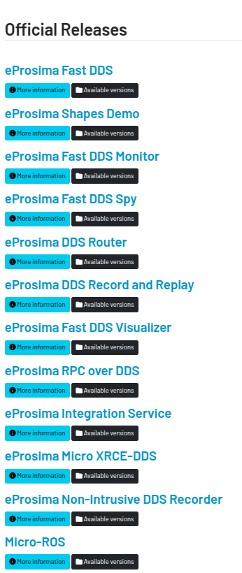

# FAST DDS

bin 可以从[https://www.eprosima.com/index.php?option=com_ars&view=categories&layout=normal](https://www.eprosima.com/index.php?option=com_ars&view=categories&layout=normal) 下载，提供一个
FAST DDS 感觉不是特别面向个人，安装编译还是很耗时的

这个机构工作还挺多的

# AIMRT架构

- 两种通讯接口范式
    - RPC      请求-响应
    - Channel 发布-订阅
        - ROS2

# 上层协议封装

- 要高度适配自己的工作流