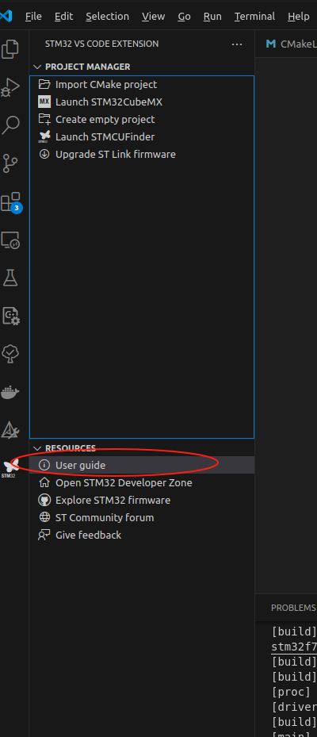
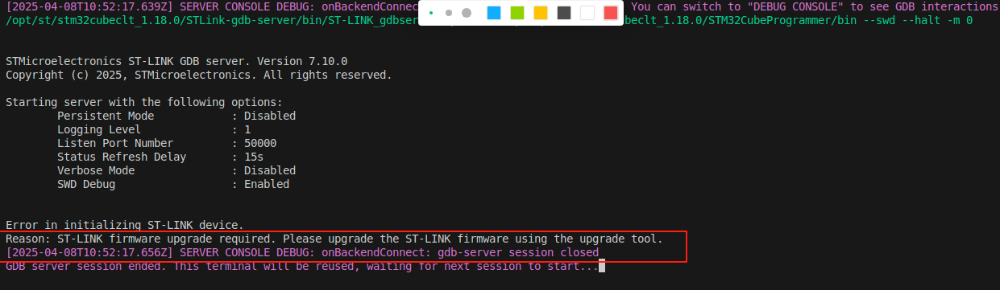
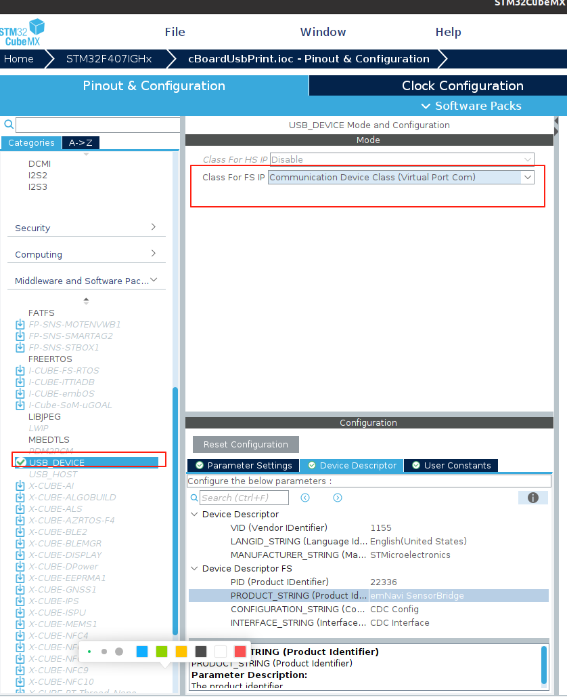
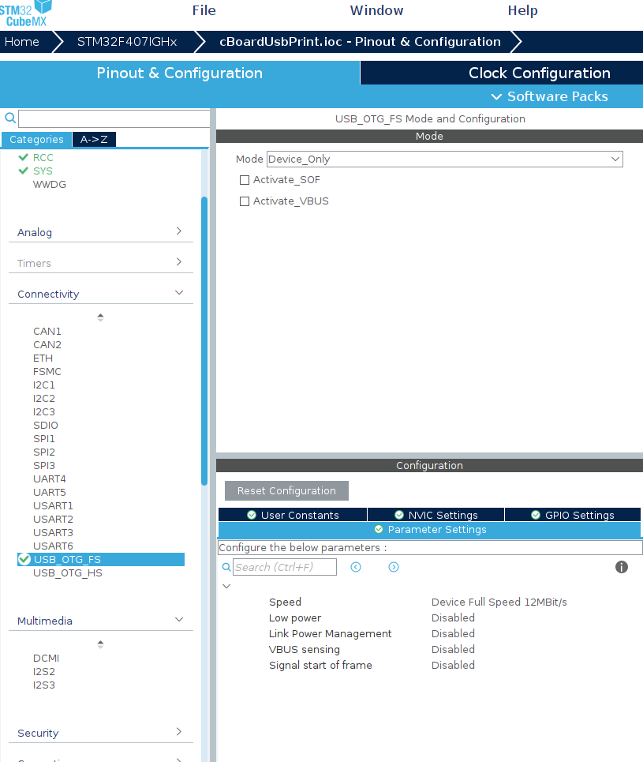

# 在linux上写stm32的程序


> 使用 Ubuntu 20.04
> 

你需要一个st账号用于安装


# 安装

- CLT

[https://www.st.com/en/development-tools/stm32cubeclt.html#get-software](https://www.st.com/en/development-tools/stm32cubeclt.html#get-software)

- CUBE mx

[https://www.st.com.cn/zh/development-tools/stm32cubemx.html#get-software](https://www.st.com.cn/zh/development-tools/stm32cubemx.html#get-software)

- mcu finder

[https://www.st.com/en/development-tools/st-mcu-finder-pc.html#get-software](https://www.st.com/en/development-tools/st-mcu-finder-pc.html#get-software)


# 创建一个cube proj




可能需要升级 stlink 固件



# 配置USB 串口ACM

> 裸机
非常简单





现在测试输出

```c
//添加
#include "usbd_cdc_if.h"

void Send_USB_Message(const char *message)
{
  CDC_Transmit_FS((uint8_t *)message, strlen(message));
}

void main()
{
    while(1){
        Send_USB_Message("emNavi Sensor Bridge!\n");
        HAL_Delay(1000); // Send message every second
        // You can add more functionality here, like reading sensors or handling other tasks.
        Send_USB_Message("This is a test\n");
        HAL_Delay(1000); // Send message every second
    }
}
```

接收消息

在 `usbd_cdc_if.c` 中修改`CDC_Receive_FS`

```c
static int8_t CDC_Receive_FS(uint8_t* Buf, uint32_t *Len)
{
  /* USER CODE BEGIN 6 */
  USBD_CDC_SetRxBuffer(&hUsbDeviceFS, &Buf[0]);
  USBD_CDC_ReceivePacket(&hUsbDeviceFS);

  for (uint32_t i = 0; i < *Len; i++) {
	  //简单回显
    CDC_Transmit_FS((uint8_t *)Buf, strlen(Buf));

  }
  return (USBD_OK);
  /* USER CODE END 6 */
}
```

# 兼容老的 gcc

在CMakeLists.txt同级文件中使用新建`use_old_gcc.sh`

```bash
#!/bin/bash

basePath=${1}
# 定义文件路径
FILE="${basePath}/STM32F407XX_FLASH.ld"

echo $(pwd)

echo "find gcc version"
# 定义一个函数来执行脚本
modify_ld_file() {
    # 检查文件中是否包含特定字符串
    if grep -q "remove it if using GCC10 or earlier" "$FILE"; then
        # 文件中包含该字符串，删除106到149行
        sed -i '106,149d' "$FILE"
        echo "Lines 106 to 149 have been deleted."
    else
        echo "The specified string was not found in the file."
    fi
}
# 获取 GCC 版本
GCC_VERSION=$(gcc --version | head -n 1 | awk '{print $3}')
GCC_MAJOR_VERSION=$(echo $GCC_VERSION | cut -d'.' -f1)
GCC_MINOR_VERSION=$(echo $GCC_VERSION | cut -d'.' -f2)

# 比较版本
if [ "$GCC_MAJOR_VERSION" -lt 11 ]; then
    echo "GCC version is less than 11, executing the script."    
    modify_ld_file
else
    echo "GCC version is 11 or greater, skipping the script."
fi

```

在 CMakeLists.txt中添加

```makefile
execute_process(
    COMMAND bash "${CMAKE_SOURCE_DIR}/use_old_gcc.sh" ${CMAKE_SOURCE_DIR}
    RESULT_VARIABLE result
    ERROR_VARIABLE err
    OUTPUT_VARIABLE output
)
# 打印脚本执行的结果
message(STATUS "Result: ${result}")
message(STATUS "Error: ${err}")
message(STATUS "Output: ${output}")
```