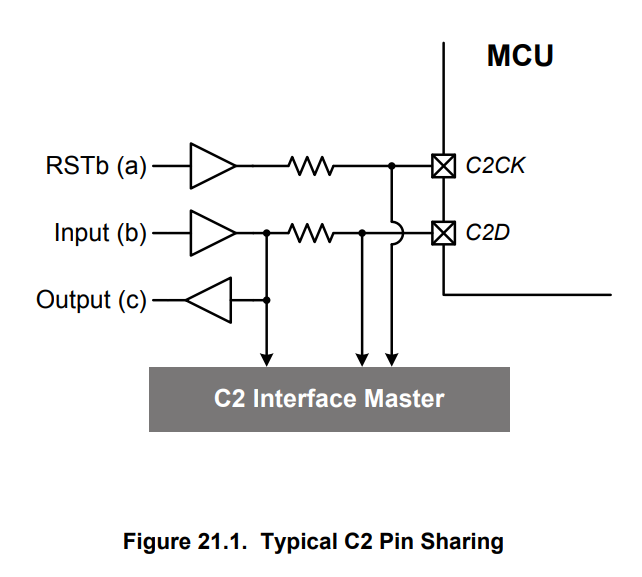
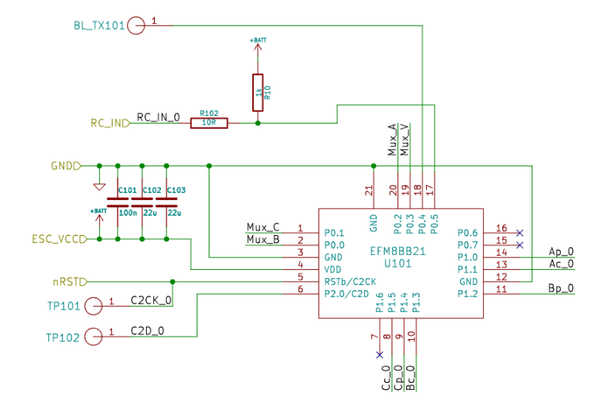

# bluejay


用起来还是比较简单的

# ESC bluejay 开源电调


https://github.com/mathiasvr/bluejay/wiki

Bluejay 在基于 EFM8 Busy Bee 的 ESC 上运行，最显著的是作为 BLHeli_S 固件的升级。

> carzyfiles 使用的是 efm8bb21 ，立创上的单价是6.73
> 

与 BLHeli_S 不同，Bluejay 不支持任何基于传统模拟 PWM 的协议。目前，DShot 是唯一支持的协议，允许提供精确可靠的信号以及 RPM 遥测等现代功能。


| Bitrate | ESC Support |
| --- | --- |
| 150 | `BB1 (L)` |
| 300 | `BB1 (L)`, `BB2 (H)` |
| 600 | `BB2 (H)` |

# 文档

- 官方文档: https://bird-sanctuary.github.io/bluejay-documentation/
- 最佳 BLHeli_32 设置以实现最佳 FPV 无人机性能
- How to Flash Bluejay ESC Firmware and Best Settings

# 设置

https://github.com/bird-sanctuary/bluejay/wiki/Settings

- C2 刷固件https://github.com/bird-sanctuary/bluejay/wiki/Unbrick-ESC


## Crazyflies 硬件

- EFM 8 文档https://www.silabs.com/documents/public/reference-manuals/efm8bb1-rm.pdf
- crazyfiles 原理图 https://github.com/bitcraze/hardware/blob/master/src/products/crazyflie-2_1_brushless/electronics/cf2.1_bl_schematics_Rev.G.pdf
- EFM 8芯片的标准刷固件方式c2 ；C2 is a 2-pin protocol.






可以看到，Crazyflies上的两个测试点是用来刷固件的


对应的layout 应该是D ,错了 

```bash
; Hardware definition file "D".
;
; Com fets are active low for H/L_N driver and EN_N/PWM driver.
; "A" with different comp.
;
; PORT 0                   |  PORT 1                   |  PWM    COM    PWM    LED
; P0 P1 P2 P3 P4 P5 P6 P7  |  P0 P1 P2 P3 P4 P5 P6 P7  |  inv    inv    side    n
; -----------------------  |  -----------------------  |  -------------------------
; Bm Cm Am Vn __ RX __ __  |  Ap Ac Bp Bc Cp Cc __ __  |  no     yes    high   _
;
;**** **** **** **** **** **** **** **** **** **** **** **** ****
```

代码中找到了其实是O

https://github.com/bitcraze/bluejay/commit/f97478a78217029ea6e546ac372aa50bb13131ec

这个接口显然无法直接使用串口，需要使用 

https://github.com/bird-sanctuary/bluejay/wiki/Unbrick-ESC


# 刷写

- https://esc-configurator.com/

还有一个

# 技术点

## 设置项

- **(PWM Dithering) ：PWM 抖动，一种增加PWM分辨率的方式，模拟11位的pwm分辨率**