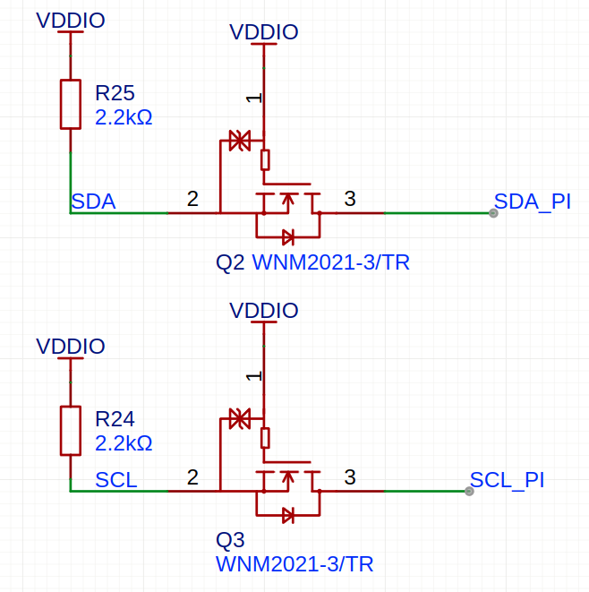

I2C 电压转换电路

# 3.3V 到 1.8V

WNM2012-3/TR是一个N沟道 mos 管

当SDA输出高电平时：MOS管Q1的Vgs = 0，MOS管关闭，SDA_PI被电阻(没画)上拉到3.3V。
当SDA输出低电平时：MOS管Q1的Vgs = 1.8V，大于导通电压，MOS管导通，SDA_PI通过MOS管被拉到低电平。

当SDA_PI输出高电平时：MOS管Q1的Vgs不变，MOS维持关闭状态，SDA1被电阻R25上拉到1.8V。
当SDA_PI输出低电平时：MOS管不导通，但是它有个寄生二极管！MOS管里的寄生二极管把SDA拉低到低电平，此时Vgs约等于1.8V，MOS管导通，进一步拉低了SDA的电压。

对于 输入电压 1.8V 即 SDA_PI 高电平是1.8V的情况。依然成立